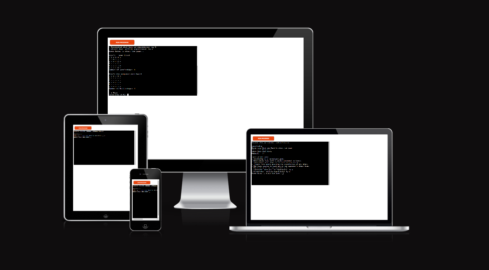
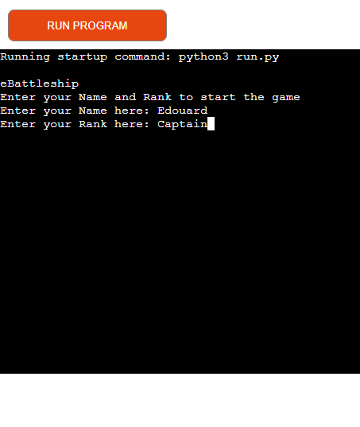
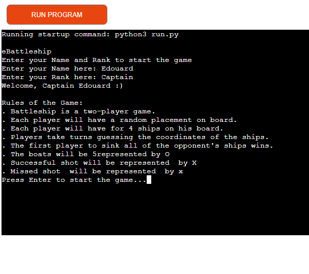
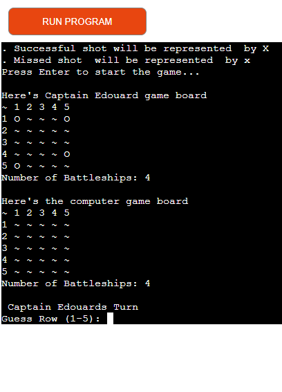
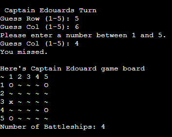
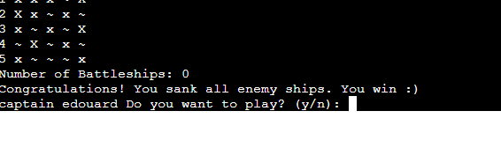

# **eBattleship**

https://ui.dev/amiresponsive?url=https://ebattleship-b7049253739c.herokuapp.com/

#### Visit the live Website : **https://ebattleship-b7049253739c.herokuapp.com/**

# Project

### Project Goals

Immerse yourself in the virtual world of digital battleship! Face off against computer opponents in a classic game.

### User Goals

- Play a game
- Relaxe and have fun

# UX

### **Audience Definition**

The targeted audience is international with an age range of 11 to 75 years old people. This audience is either children, or adults that are interested in classic game.

### **User Stories**

1. As a first time user :

   - The navigation to be easy and intuitive.
   - I want to understand immediately what is the website about without the need of looking for it.

2. As a returning user :
   - Challenge myself on the game.

# Features

#### Welcoming

- We start the game by asking name and the rank of the player.
- An explanation of the game is provided to the player.

#### Random board is generating

- Will display a game board for both the player and the computer.

- Input validation and error checking.

- Ask if you want to play again at the end of the game.

### **Features to Implement in the Future Versions**

- Extension of the game with different size of ships 
- Allow player to place the ships on the board
- Have a bigger board game 
- Add music
- Contact
- Copyright

# Technologies Used

### Programming Languages

This project uses Python.

### Frameworks, Libraries and Programs

* [codeanywhere](https://app.codeanywhere.com/)  
  For Integrated Development Environment.

 * [GitPod](https://www.gitpod.io/)  
  For Integrated Development Environment.

* [GitHub](https://github.com/)  
  For storing the repository.

* [heroku Pages](https://dashboard.heroku.com/apps)  
  For deploying the website live.

# Deployment

The project was deployed following the instructions provided by the Code Institute.
      
- Create new app in heroku
  - Set up the setting in Heroku
    * Add buildpack (Python, node.js,)
  - Set up the deploy in Heroku
    * Link Heroku app to the repository Githup
    * Chose the deployment method
 - Click on view to see the app

# Testing

I have tested on my local terminal provided by code institute.

# Validator testing

- PEP 8

No major errors were found when passing through the PEP 8

Error find is 
 - E501: line too long

# Bugs
- example of bug :
    - IndentationError: unindent does not match any outer indentation level
    - UnboundLocalError: cannot access local variable 'num_ships' where it is not associated with a value 

- No bug remainings

# Credit
 - Code institute for the deployment terminal and for random function.
 - Wikipedia for the battleship game

### Acknowledgments. :

Special thanks to all Code Institute's team ("Teacher", Lecturers and Tutors) that are making me more knowledgeable and are making this happen.

Huge thank you to the [Slack](code-institute-room.slack.com) community, all its members and all the leads and tutors for their help and support.

Thanks to my mentor Precious_Mentor for guiding me through this project.